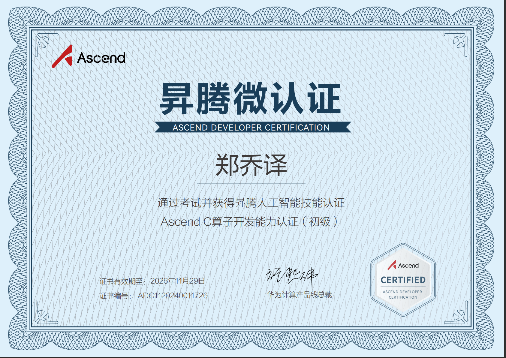

### Ascend C实践与实验报告 
#### 认证成绩

#### 证书
初级：

中级：

#### 实验过程
1. 代码编写
+ op_host: sinh_custom.cpp
```
#include "sinh_custom_tiling.h"
#include "register/op_def_registry.h"

namespace optiling {
/**
Tiling Func负责对输入数据进行分块（Tile）处理。分块处理的好处在于，可以并行计算不同块中的数据，提升计算效率。
BLOCK_DIM 定义了每次计算操作需要处理的块的数量。
TILE_NUM 定义了在每个计算块中进一步将数据划分为更小的子块。每个子块的数据大小由blocklength/TILE_NUM来决定。
该方法将 totalLength 和 TILE_NUM 此类方法保存在tiling对象中，随后将这些信息写入`RawTilingData`中
**/
static ge::graphStatus TilingFunc(gert::TilingContext* context)
{
    SinhCustomTilingData tiling;
    //考生自行填充
    const uint32_t BLOCK_DIM = 8;
    const uint32_t TILE_NUM = 8;
    uint32_t totalLength = context->GetInputShape(0)->GetOriginShape().GetShapeSize();
    context->SetBlockDim(BLOCK_DIM);
    tiling.set_totalLength(totalLength);
    tiling.set_tileNum(TILE_NUM);
    tiling.SaveToBuffer(context->GetRawTilingData()->GetData(), 
    context->GetRawTilingData()->GetCapacity());
    context->GetRawTilingData()->SetDataSize(tiling.GetDataSize());
    size_t *currentWorkspace = context->GetWorkspaceSizes(1);
    currentWorkspace[0] = 0;
    return ge::GRAPH_SUCCESS;
}
}
/**
这个函数定义了输入与输出的形状推理逻辑，保证输入和输出的形状是相同的。
**/
namespace ge {
static ge::graphStatus InferShape(gert::InferShapeContext* context)
{
    const gert::Shape* x1_shape = context->GetInputShape(0);
    gert::Shape* y_shape = context->GetOutputShape(0);
    *y_shape = *x1_shape;
    return GRAPH_SUCCESS;
}
}
/**
该类定义了一个自定义的sinh算子，明确了输入和输出的张量格式和数据类型（DT_FLOAT16），并且指定该算子的推理形状函数是InferShape，Tiling函数是TilingFunc。
最后，通过OP_ADD(SinhCustom)将该算子注册到Ascend编译器中。
**/
namespace ops {
class SinhCustom : public OpDef {
public:
    explicit SinhCustom(const char* name) : OpDef(name)
    {
        this->Input("x")
            .ParamType(REQUIRED)
            .DataType({ge::DT_FLOAT16})
            .Format({ge::FORMAT_ND})
            .UnknownShapeFormat({ge::FORMAT_ND});
        this->Output("y")
            .ParamType(REQUIRED)
            .DataType({ge::DT_FLOAT16})
            .Format({ge::FORMAT_ND})
            .UnknownShapeFormat({ge::FORMAT_ND});

        this->SetInferShape(ge::InferShape);

        this->AICore()
            .SetTiling(optiling::TilingFunc);
        this->AICore().AddConfig("ascend310b");
    }
};

OP_ADD(SinhCustom);
}

```
+ op_host:sinh_custom_tilling.h
```

#include "register/tilingdata_base.h"
/**
这里定义了tiling数据结构的字段totalLength和tileNum，它们分别表示输入数据的总长度和分块数目。通过REGISTER_TILING_DATA_CLASS将SinhCustomTilingData与算子SinhCustom进行绑定。
**/
namespace optiling {
BEGIN_TILING_DATA_DEF(SinhCustomTilingData)
  //考生自行定义tiling结构体成员变量
  TILING_DATA_FIELD_DEF(uint32_t, totalLength);
  TILING_DATA_FIELD_DEF(uint32_t, tileNum);
END_TILING_DATA_DEF;
REGISTER_TILING_DATA_CLASS(SinhCustom, SinhCustomTilingData)
}

```
+ op_kernel:sinh_custom.cpp
```
#include "kernel_operator.h"
using namespace AscendC;
constexpr int32_t BUFFER_NUM = 2;

class KernelSinh {
public:
    __aicore__ inline KernelSinh() {}
    /**
    该函数负责初始化全局和局部缓存、块和Tile的长度，并根据tileNum和blockLength来计算tileLength。
xGm.SetGlobalBuffer 和 yGm.SetGlobalBuffer 初始化全局内存上的输入和输出数据区域。
pipe.InitBuffer 初始化了多个队列和临时缓冲区，用于算子执行过程中数据的缓存和处理。
    **/
    __aicore__ inline void Init(GM_ADDR x,GM_ADDR y,uint32_t totalLength, uint32_t tileNum)
    {
        //考生补充初始化代码
        ASSERT(GetBlockNum() != 0 && "block dim can not be zero!");
        this->blockLength = totalLength / GetBlockNum();
        this->tileNum = tileNum;
        ASSERT(tileNum != 0 && "tile num can not be zero!");
        this->tileLength = this->blockLength / tileNum / BUFFER_NUM;
        xGm.SetGlobalBuffer((__gm__ DTYPE_X *)x + this->blockLength * GetBlockIdx(), 
        this->blockLength);
        yGm.SetGlobalBuffer((__gm__ DTYPE_Y *)y + this->blockLength * GetBlockIdx(), 
        this->blockLength);
        pipe.InitBuffer(inQueueX, BUFFER_NUM, this->tileLength * sizeof(DTYPE_X));
        pipe.InitBuffer(outQueueY, BUFFER_NUM, this->tileLength * sizeof(DTYPE_Y));
        pipe.InitBuffer(tmpBuffer1, this->tileLength * sizeof(DTYPE_X));
        pipe.InitBuffer(tmpBuffer2, this->tileLength * sizeof(DTYPE_X));
        pipe.InitBuffer(tmpBuffer3, this->tileLength * sizeof(DTYPE_X));
        pipe.InitBuffer(tmpBuffer4, this->tileLength * sizeof(DTYPE_X));
    }
    __aicore__ inline void Process()
    {
        /*
        Process函数执行主循环，每次循环中执行三个步骤：从全局内存拷贝数据到局部内存（CopyIn），计算（Compute），然后将结果从局部内存拷贝回全局内存（CopyOut）。
        */
        int32_t loopCount = this->tileNum*BUFFER_NUM;
        for (int32_t i = 0; i < loopCount; i++) {
            CopyIn(i);
            Compute(i);
            CopyOut(i);
        }
    }

private:
    __aicore__ inline void CopyIn(int32_t progress)
    {
        //考生补充算子代码
        LocalTensor<DTYPE_X> xLocal = inQueueX.AllocTensor<DTYPE_X>();
        DataCopy(xLocal, xGm[progress * this->tileLength], this->tileLength);
        inQueueX.EnQue(xLocal);
    }
    __aicore__ inline void Compute(int32_t progress)
    {
        //考生补充算子计算代码
        LocalTensor<DTYPE_X> xLocal = inQueueX.DeQue<DTYPE_X>();
        LocalTensor<DTYPE_Y> yLocal = outQueueY.AllocTensor<DTYPE_Y>();
        LocalTensor<DTYPE_X> tmpTensor1 = tmpBuffer1.Get<DTYPE_X>();
        LocalTensor<DTYPE_X> tmpTensor2 = tmpBuffer2.Get<DTYPE_X>();
        LocalTensor<DTYPE_X> tmpTensor3 = tmpBuffer3.Get<DTYPE_X>();
        LocalTensor<DTYPE_X> tmpTensor4 = tmpBuffer4.Get<DTYPE_X>();
        DTYPE_X inputVal1 = -1;
        DTYPE_X inputVal2 = 0.5;
        //sinh(x) = (exp(x) - exp(-x)) / 2.0
        /**
        将输入张量乘以-1（Muls），得到-x。
		计算exp(-x)（Exp）。
		计算exp(x)。
		计算exp(x) - exp(-x)（Sub）。
		将结果乘以0.5，得到sinh(x)的结果（Muls）。
        **/
        Muls(tmpTensor1, xLocal, inputVal1, this->tileLength);
        Exp(tmpTensor2, tmpTensor1, this->tileLength);
        Exp(tmpTensor3, xLocal, this->tileLength);
        Sub(tmpTensor4, tmpTensor3, tmpTensor2, this->tileLength);
        Muls(yLocal, tmpTensor4, inputVal2, this->tileLength);
        outQueueY.EnQue<DTYPE_Y>(yLocal);
        inQueueX.FreeTensor(xLocal);
    }
    __aicore__ inline void CopyOut(int32_t progress)
    {
        //考生补充算子代码
        LocalTensor<DTYPE_Y> yLocal = outQueueY.DeQue<DTYPE_Y>();
        DataCopy(yGm[progress * this->tileLength], yLocal, this->tileLength);
        outQueueY.FreeTensor(yLocal);
    }

private:
    TPipe pipe;
    //create queue for input, in this case depth is equal to buffer num
    TQue<QuePosition::VECIN, BUFFER_NUM> inQueueX;
    //create queue for output, in this case depth is equal to buffer num
    TQue<QuePosition::VECOUT, BUFFER_NUM> outQueueY;
    GlobalTensor<half> xGm;
    GlobalTensor<half> yGm;

    //考生补充自定义成员变量
    TBuf<QuePosition::VECCALC> tmpBuffer1, tmpBuffer2, tmpBuffer3, tmpBuffer4;
    uint32_t blockLength;
    uint32_t tileNum;
    uint32_t tileLength;
};
/**
这是最终的自定义内核函数，通过Init函数初始化操作，并调用Process函数执行具体计算。
**/
extern "C" __global__ __aicore__ void sinh_custom(GM_ADDR x, GM_ADDR y, GM_ADDR workspace, GM_ADDR tiling) {
    GET_TILING_DATA(tiling_data, tiling);
    KernelSinh op;
    //补充init和process函数调用内容
    op.Init(x, y, tiling_data.totalLength, tiling_data.tileNum);
    op.Process();
}
```
2. cd /root/SinhCustom/SinhCustom，运行bash build.sh
成功后出现build_out文件夹
3. cd /root/SinhCustom/SinhCustom/build_out  尝试运行./custom_opp_ubuntu_aarch64.run 
success。
4. cd /root/SinhCustom/AclNNInvocation 
bash run.sh 
+ 报错，找不到相关.h文件 
    于是将SinhCustom\SinhCustom\build_out\autogen中的.h文件和.cpp文件复制到SinhCustom11\SinhCustom\AclNNInvocation中include和scr文件夹中，然后在cmakelist中添加对应的编译选项。
+ 重新运行，依旧报错，找不到相关的库，执行命令，找到对应库的位置，然后在cmakelist里链接相关的库。
+ 重新运行，成功完成实验。
