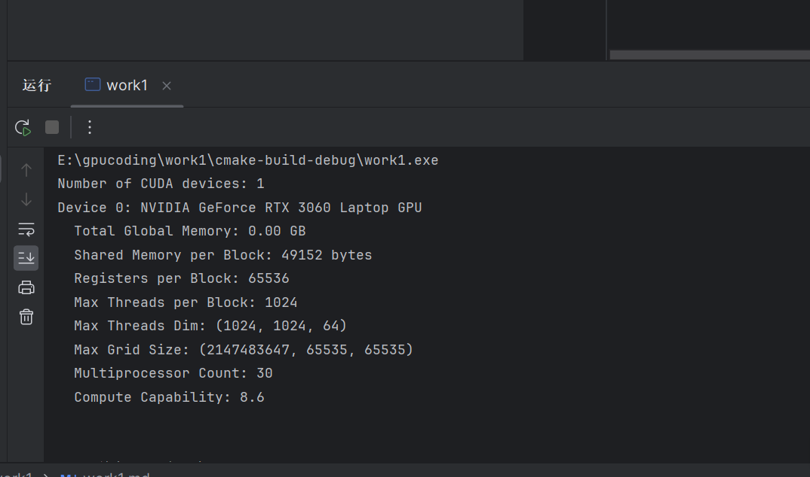
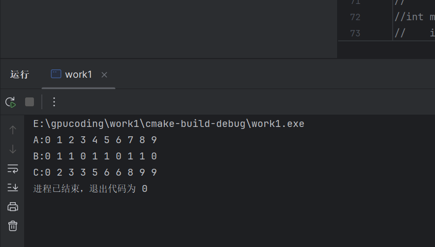

## 作业1

1. 查询你机器上GPU设备的参数
```
#include <stdio.h>
#include <cuda_runtime.h>

int main() {
int deviceCount = 0;

    cudaGetDeviceCount(&deviceCount);
    printf("Number of CUDA devices: %d\n", deviceCount);

    for (int i = 0; i < deviceCount; ++i) {
        cudaDeviceProp prop;
        cudaGetDeviceProperties(&prop, i);

        printf("Device %d: %s\n", i, prop.name);
        printf("  Total Global Memory: %.2f GB\n", prop.totalGlobalMem / (1 << 30));
        printf("  Shared Memory per Block: %d bytes\n", prop.sharedMemPerBlock);
        printf("  Registers per Block: %d\n", prop.regsPerBlock);
        printf("  Max Threads per Block: %d\n", prop.maxThreadsPerBlock);
        printf("  Max Threads Dim: (%d, %d, %d)\n", prop.maxThreadsDim[0], prop.maxThreadsDim[1], prop.maxThreadsDim[2]);
        printf("  Max Grid Size: (%d, %d, %d)\n", prop.maxGridSize[0], prop.maxGridSize[1], prop.maxGridSize[2]);
        printf("  Multiprocessor Count: %d\n", prop.multiProcessorCount);
        printf("  Compute Capability: %d.%d\n", prop.major, prop.minor);
        printf("\n");
    }

    return 0;
```
运行结果：


2. vectorsum 代码如下
```
    #include <stdio.h>
#include <cuda_runtime.h>
#include <iostream>
#include "vector"
#define N 10
using namespace std;

__global__ void add(double *A,double *B,double *C,int n)
{
    int index = blockDim.x*blockIdx.x + threadIdx.x;
    //blockdim  numbersof threads in block
    //blockidx  index of block in grid
    //threadidx index in block

    int stride = blockDim.x*gridDim.x;
    //stride thread numbers

    for(int i = index;i < n;i += stride)
    {
        C[i] = A[i] + B[i];
    }

}
int main()
{
    int n =N;
    double *dev_A,*dev_B,*dev_C;
    double A[N],B[N],C[N];

    for(int i = 0;i < n;i ++)
    {
        A[i] = i;
        B[i] = i*i%3;
    }

    cudaMalloc(&dev_A, n * sizeof(double));
    cudaMalloc(&dev_B, n * sizeof(double));
    cudaMalloc(&dev_C, n * sizeof(double));

    cudaMemcpy(dev_A,A,n*sizeof(double),cudaMemcpyHostToDevice);
    cudaMemcpy(dev_B,B,n*sizeof(double),cudaMemcpyHostToDevice);

    int blocksize = 32;
    int numblocks = (n + blocksize - 1)/blocksize;
    add<<<numblocks,blocksize>>>(dev_A,dev_B,dev_C,n);
    //<<<numBlocks, blockSize>>>

    cudaMemcpy(C,dev_C,n*sizeof(double),cudaMemcpyDeviceToHost);

    cout << "A:";
    for(int i = 0;i < n;i ++)
    {
        cout << A[i] << " ";
    }

    cout << "\nB:";
    for(int i = 0;i < n;i ++)
    {
        cout << B[i] << " ";
    }

    cout << "\nC:";
    for(int i = 0;i < n;i ++)
    {
        cout << C[i] << " ";
    }

}
```
运行结果：


