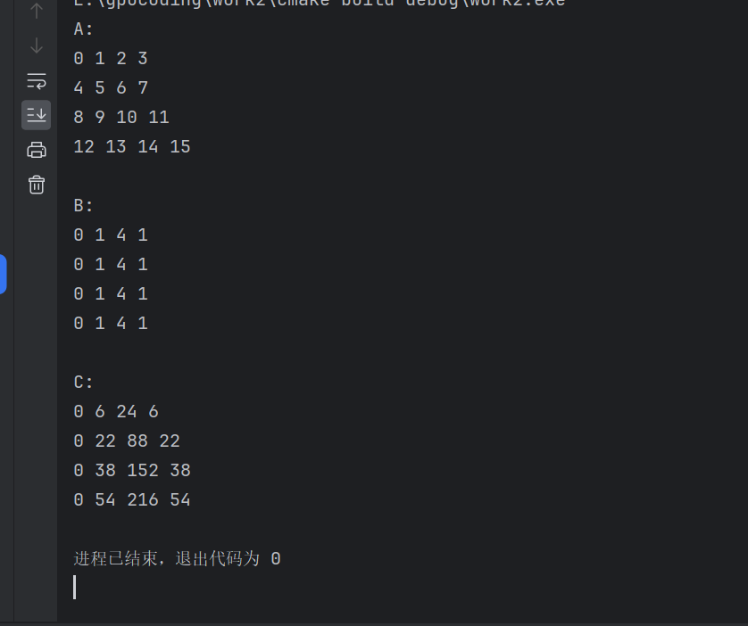

1. 矩阵相乘
+ CPU:
```
    void matrixMulCpu(float* A, float* B, float* C, int width){
    float sum = 0.0f;
    for(int i = 0; i < width; i++){
        for(int j = 0; j < width; j++){
            for(int l = 0; l < width; l++){
                sum += A[i * width + l] * B[l * width + j];
            }
            C[i * width + j] = sum;
            sum = 0.0f;
        }
    }
```

+ GPU:
1. 每一个线程处理一个C[i][j],用多个block组成的矩阵覆盖整个结果矩阵。其中``x_index``和``y_index``代表线程在矩阵中的位置，``if (x_index < width && y_index < width)``确保了不被整除的情况。
```
#include <stdio.h>
#include <cuda_runtime.h>
#include <iostream>
#include "vector"
#define N 16
using namespace std;

__global__ void muiltiply(double *A,double *B,double *C,int width) {
    int x_index = threadIdx.x + blockDim.x * blockIdx.x;
    int y_index = threadIdx.y + blockDim.y * blockIdx.y;

    if (x_index < width && y_index < width) {
        int sum = 0;
        for (int i = 0; i < width; i++) {
            sum += A[y_index * width + i] * B[i * width + x_index];
        }
        C[x_index + y_index * width] = sum;
    }

}

int main()
{
    int n =N;
    double *dev_A,*dev_B,*dev_C;
    double A[N],B[N],C[N];

    for(int i = 0;i < n;i ++)
    {
        A[i] = i;
        B[i] = i*i%8;
    }

    cudaMalloc(&dev_A, n * sizeof(double));
    cudaMalloc(&dev_B, n * sizeof(double));
    cudaMalloc(&dev_C, n * sizeof(double));

    cudaMemcpy(dev_A,A,n*sizeof(double),cudaMemcpyHostToDevice);
    cudaMemcpy(dev_B,B,n*sizeof(double),cudaMemcpyHostToDevice);

    ///<<<numBlocks, blockSize>>>
    ///choose the size
    dim3 blockdim(3,3);
    dim3 griddim(2,2);
    muiltiply<<<griddim,blockdim>>>(dev_A,dev_B,dev_C, sqrt(n));

    cudaMemcpy(C,dev_C,n*sizeof(double),cudaMemcpyDeviceToHost);

    cout << "A:\n";
    int width = sqrt(n);

    for(int ii = 0; ii < n;ii += width)
    {
        for(int i = ii;i < ii + width;i ++)
        {
            cout << A[i] << " ";
        }
        cout << "\n";
    }


    cout << "\nB:\n";
    for(int ii = 0; ii < n;ii += width)
    {
        for(int i = ii;i < ii + width;i ++)
        {
            cout << B[i] << " ";
        }
        cout << "\n";
    }

    cout << "\nC:\n";
    for(int ii = 0; ii < n;ii += width)
    {
        for(int i = ii;i < ii + width;i ++)
        {
            cout << C[i] << " ";
        }
        cout << "\n";
    }

}

```
运行结果：

   
1. 理解线程束的调度机制
验证warp的线程数量加入计时功能，对warp的调度时间进行输出，并绘出散点图进行分析变大block和grid的大小会如何？给出对线程束调度机制的理解参见COOK 5.3 和WILT 7.3.3

代码
```
#include <stdio.h>
#include <cuda_runtime.h>

#define WARP_SIZE 32

void __global__ what_is_id(unsigned int* const block,
                           unsigned int* const thread,
                           unsigned int* const warp,
                           unsigned int* const calc_thread) {
    const unsigned int thread_idx = (blockIdx.x * blockDim.x) + threadIdx.x;
    block[thread_idx] = blockIdx.x;
    thread[thread_idx] = threadIdx.x;

    warp[thread_idx] = threadIdx.x / WARP_SIZE;

    calc_thread[thread_idx] = thread_idx;

    if (thread_idx == 0 ||
        block[thread_idx - 1] != block[thread_idx] ||
        warp[thread_idx - 1] != warp[thread_idx]) {
        printf("blockId:%d, warp:%d\n", block[thread_idx], warp[thread_idx]);
    }
}
int main() {
    cudaDeviceProp prop;
    int device;
    int threadSize = 1024;
    int blockSize = 128;
    int gridSize = 2;
    unsigned int h_block[1024];
    unsigned int h_thread[1024];
    unsigned int h_warp[1024]; // Not typically used in this way; warp size is fixed by GPU hardware
    unsigned int *d_block, *d_thread, *d_warp, *d_calc_thread;

    cudaGetDevice(&device);
    cudaGetDeviceProperties(&prop, device);
    // Printing warp size for demonstration purposes
    printf("warpSize: %d\n", prop.warpSize);

    // Allocate device memory
    cudaMalloc((void**)&d_block, threadSize * sizeof(unsigned int));
    cudaMalloc((void**)&d_thread, threadSize * sizeof(unsigned int));
    cudaMalloc((void**)&d_warp, threadSize * sizeof(unsigned int));
    cudaMalloc((void**)&d_calc_thread, threadSize * sizeof(unsigned int));

    // Initialize host arrays (not strictly necessary as they will be overwritten by cudaMemcpy, but good practice)
    for (int i = 0; i < threadSize; i++) {
        h_block[i] = 0;
        h_thread[i] = 0;
        h_warp[i] = 0; // Again, not typically used; just for demonstration
    }

    // Copy host arrays to device
    cudaMemcpy(d_block, h_block, threadSize * sizeof(unsigned int), cudaMemcpyHostToDevice);
    cudaMemcpy(d_thread, h_thread, threadSize * sizeof(unsigned int), cudaMemcpyHostToDevice);
    cudaMemcpy(d_warp, h_warp, threadSize * sizeof(unsigned int), cudaMemcpyHostToDevice);

    // Launch CUDA kernel
    what_is_id<<<gridSize, blockSize>>>(d_block, d_thread, d_warp, d_calc_thread);

    // Note: No cudaMemcpy back to host is performed here; typically, you would copy the results back to verify them.

    // Free device memory
    cudaFree(d_block);
    cudaFree(d_thread);
    cudaFree(d_warp);
    cudaFree(d_calc_thread);

    return 0;
}
```
### 增大Block大小
#### 资源占用：
每个block会占用一定的共享内存（shared memory）和寄存器（register）。当block大小增大时，每个block所需的资源也会相应增加。
如果block占用的资源过多，可能会导致SM（Streaming Multiprocessor）中能够同时执行的block数量减少，进而影响并行性能。
#### warp调度：
一个block中的warp数量由该block中的线程数量除以warp大小（通常为32）决定。增大block大小意味着每个block中包含更多的线程，从而可能产生更多的warp。
然而，由于SM中同时并发的warp数量有限，增大block大小并不一定会导致更多的warp被同时调度执行。当block大小增加到一定程度时，可能会因为资源限制而无法再增加同时执行的warp数量。
#### 性能影响：
合理的block大小可以充分利用SM的资源，提高并行性能。但是，过大的block可能会导致资源竞争和上下文切换的增加，从而降低性能。
增大block大小可能会增加内存访问的延迟和带宽压力，因为每个block需要访问的数据量可能增加。
##### 增大Grid大小
#### 任务划分：
Grid是由多个block组成的，增大Grid大小意味着将计算任务划分为更多的block。
这有助于将任务更均匀地分布到不同的SM上，提高GPU的利用率和并行性能。
#### warp调度：
增大Grid大小并不会直接影响warp的调度机制，因为warp的调度是由SM内部的warp scheduler负责的。
但是，更多的block意味着有更多的机会将warp分配到不同的SM上执行，从而提高整体的并行性能。
#### 性能影响：
增大Grid大小通常有助于提高GPU的利用率和并行性能，因为可以更有效地利用GPU的硬件资源。
然而，过大的Grid大小可能会导致管理上的复杂性增加，例如需要更多的内存来存储block的信息和状态等。


