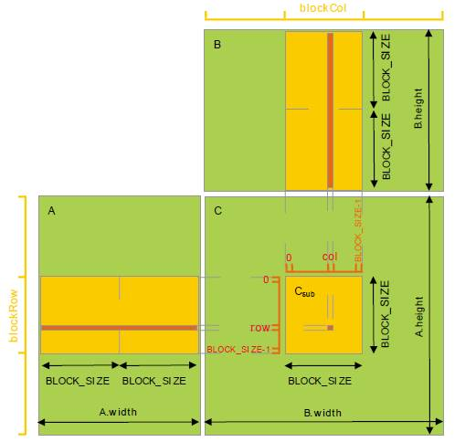

### 作业3

#### 1. CPU代码
```
vord brck(array A, array B, array C, int n, int bsize)
{
    int r, c, k, kk, cc;
    double sum;
    int en = bsize * (n/bsize); /* Amount that frts evenly into blocks */
   
    for (r = 0; r < n; r++)
        for (c = 0; c < n; c++)
            C[r][c] = 0.0;
 
    for (kk = 0; kk < en; kk += bsize) {
        for (cc = 0; cc < en; cc += bsize) {
            for (r = 0; r < n; r++) {
                for (c = cc; c < min(cc + bsize,en),; c++) {
                    sum = C[r][c];
                    for (k = kk; k < min(kk + bsize,en); k++) {
                         sum += A[r][k]*B[k][c];
                    }
                    C[r][c] = sum;
                }
            }
        }
    }
}
```

#### 2. GPU实现

让一个 block 内的 thread 先从 Global Memory 中读取子矩阵块数据（大小为 BLOCK_SIZE × BLOCK_SIZE）并写入 Shared Memory 中；在计算时，从 Shared Memory 中（重复）读取数据做乘累加，从而避免每次都到 Global 中取数据带来的高延迟影响。接下来让子矩阵块分别在矩阵 A 的行向以及矩阵 B 的列向上滑动，直到计算完所有 width 个元素的乘累加。使用 Shared Memory 优化后的 kernel 代码如下所示：

```
#include <stdio.h>
#include <cuda_runtime.h>
#include <iostream>
#include "vector"
#define N 16
#define BLOCKSIZE 2
using namespace std;

__global__ void muiltiply_shared_mem(double *A,double *B,double *C,int width)
{
    /// a block is a submatrix
    __shared__ double A1[BLOCKSIZE* BLOCKSIZE];
    __shared__ double B1[BLOCKSIZE* BLOCKSIZE];

    int x_index = threadIdx.x + blockDim.x*blockIdx.x;
    int y_index = threadIdx.y + blockDim.y*blockIdx.y;

    ///load data
    double sum_ = 0;
    for(int i = 0;i < width/BLOCKSIZE;i++)
    {
        A1[threadIdx.y*BLOCKSIZE + threadIdx.x] = A[y_index*width + threadIdx.x + i * BLOCKSIZE];
        B1[threadIdx.y*BLOCKSIZE + threadIdx.x] = B[width*(threadIdx.y + i*BLOCKSIZE) + x_index];
        /// load all data in the submatrix
        __syncthreads();


        ///for each thread
        for(int j = 0;j < BLOCKSIZE;j++)
        {
            sum_ += A1[threadIdx.y*BLOCKSIZE + j]*B1[j*BLOCKSIZE + threadIdx.x];
        }

        __syncthreads();
        ///after calculate ,then load the next buffer

    }

    C[y_index*width + x_index] = sum_;

}
int main()
{
    int n =N;
    double *dev_A,*dev_B,*dev_C;
    double A[N],B[N],C[N];

    for(int i = 0;i < n;i ++)
    {
        A[i] = i;
        B[i] = i*i%8;
    }

    cudaMalloc(&dev_A, n * sizeof(double));
    cudaMalloc(&dev_B, n * sizeof(double));
    cudaMalloc(&dev_C, n * sizeof(double));

    cudaMemcpy(dev_A,A,n*sizeof(double),cudaMemcpyHostToDevice);
    cudaMemcpy(dev_B,B,n*sizeof(double),cudaMemcpyHostToDevice);

    ///<<<numBlocks, blockSize>>>
    ///choose the size
    dim3 blockdim(BLOCKSIZE,BLOCKSIZE);
    dim3 griddim(sqrt(n)/BLOCKSIZE,sqrt((n)/BLOCKSIZE));

    double t1,t2;
    t1 = clock();
    muiltiply_shared_mem<<<griddim,blockdim>>>(dev_A,dev_B,dev_C, sqrt(n));
    t2 = clock();

    cudaMemcpy(C,dev_C,n*sizeof(double),cudaMemcpyDeviceToHost);

    cout << "A:\n";
    int width = sqrt(n);

    for(int ii = 0; ii < n;ii += width)
    {
        for(int i = ii;i < ii + width;i ++)
        {
            cout << A[i] << " ";
        }
        cout << "\n";
    }


    cout << "\nB:\n";
    for(int ii = 0; ii < n;ii += width)
    {
        for(int i = ii;i < ii + width;i ++)
        {
            cout << B[i] << " ";
        }
        cout << "\n";
    }

    cout << "\nC:\n";
    for(int ii = 0; ii < n;ii += width)
    {
        for(int i = ii;i < ii + width;i ++)
        {
            cout << C[i] << " ";
        }
        cout << "\n";
    }

    cout <<(t2 - t1)/CLOCKS_PER_SEC<<"secs" << endl;

}

```
#### 3.性能比较

将矩阵大小扩大至6400，分别计时，使用和不使用``shared memory``的代码用时为0.001s和0.022s。
